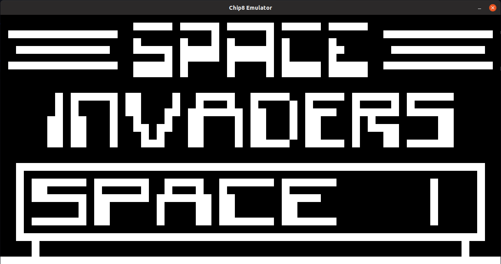

# Chip-8 in Rust



As a small project to learn some Rust, I decided to implement an emulator for the [Chip-8 Instruction Set](https://en.wikipedia.org/wiki/CHIP-8). Technically, Chip-8 is actually a virtual machine - it was developed to allow games to be more easily programmed on a wide variety of platforms.

## Running it

Run a ROM with:

```
cargo run ROMs/$GAME
```

## References

There are quite a few good references around on how to implement Chip-8 instructions. The two I used the most were:
* [Matthew Mikolay's Mastering Chip-8](http://mattmik.com/files/chip8/mastering/chip8.html)
* [Cowgod's Chip-8 Reference](http://devernay.free.fr/hacks/chip8/C8TECH10.HTM)

I also constantly referred to both the official Rust book and the SDL2 crate documentation. This was my first time making anything with SDL (in any language), so it's been quite the learning experience.
